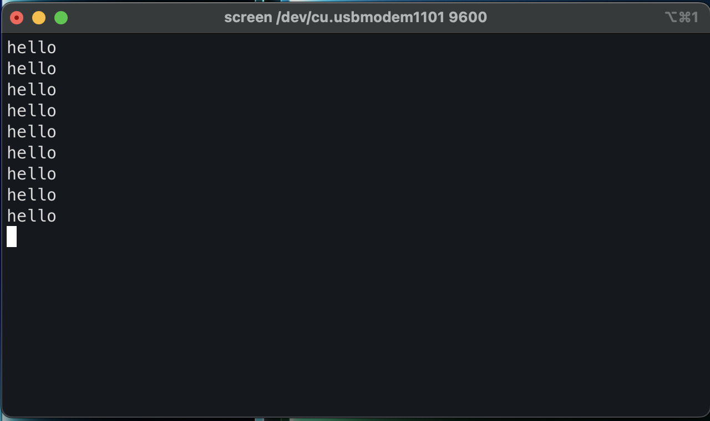

# USART Driver (ATmega328P)

A simple bare-metal USART driver written in C for the ATmega328P.

This project initializes the USART peripheral and demonstrates transmitting data over a serial connection without using the Arduino framework.

---

## Features

- USART initialization
- Configurable baud rate
- Character transmission
<!--- Character reception-->
- Blocking driver implementation

---

## Hardware

- Arduino Uno R3
    - ATmega328P
    - USB-to-Serial adapter
    - 16 MHz clock
<!-- - Breadboard -->

---

## Project Structure

```

.
|- src/
|  |- main.c
|  |- usart.c
|
|- include/
|  |- usart.h
|
|- Makefile
|- README.md

```

### Generated During Build

```text

build/
|- main.o
|- usart.o
|- program.elf
|- program.hex

```

---

## How it Works

The driver configures:

- Baud rate registers (UBRR0H/UBRR0L)
- Enables transmitter <!-- and receiver -->
- Configures 8-bit data format
- Uses polling for transmission <!-- and reception -->

Transmission waits until the transmit buffer is empty before writing a byte to UDR0.

<!-- Reception waits until data is available before reading UDR0. -->

---

## Build

```bash
make
````

Flash:

```bash
make flash
```

---

## Example

```c
usart_init(MYUBRR);

while (1)
{
    usart_transmit('A');
}
```

---

## Future Improvements

* Interrupt-driven USART
* Ring buffer
* Non-blocking API
* Configurable parity and stop bits

---

## References

* ATmega328P Datasheet

<!-- ## Breadboard Setup

 -->

## Serial Output

```bash
# check name device is available as
ls /dev/cu.*

# screen device baud-rate
screen /dev/cu.usbmodem1101 9600
```



## What I Learned

- How baud rate registers are calculated
- Difference between polling and interrupts
- How the AVR USART hardware works
- Register-level peripheral configuration

## Limitations

- Blocking transmit/receive
- No error handling
- No interrupt support
- Fixed baud rate
