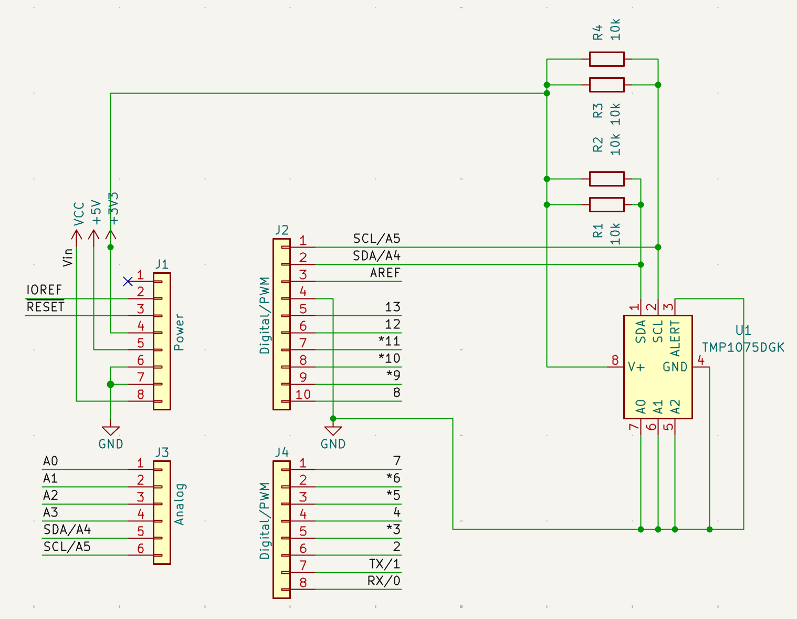

# Arduino Uno R3 + TMP1075 Temperature Sensor

A hardware project connecting a TI TMP1075 temperature sensor
to an Arduino Uno R3 using I²C.

## Schematic

## Hardware

- Arduino Uno R3
- TI TMP1075 temperature sensor
- 4 × 10 kΩ resistors
- 5 kΩ effective pull-up on SDA
- 5 kΩ effective pull-up on SCL

## Communication

The TMP1075 communicates with the Arduino using I²C:

- SDA → Arduino A4
- SCL → Arduino A5
- V+ → Arduino 3.3 V
- GND → Arduino GND

## Files

- `schematic/arduino-tmp1075.kicad_sch` — KiCad schematic source
- `schematic/arduino-tmp1075.pdf` — printable schematic
- `images/schematic.png` — schematic preview
